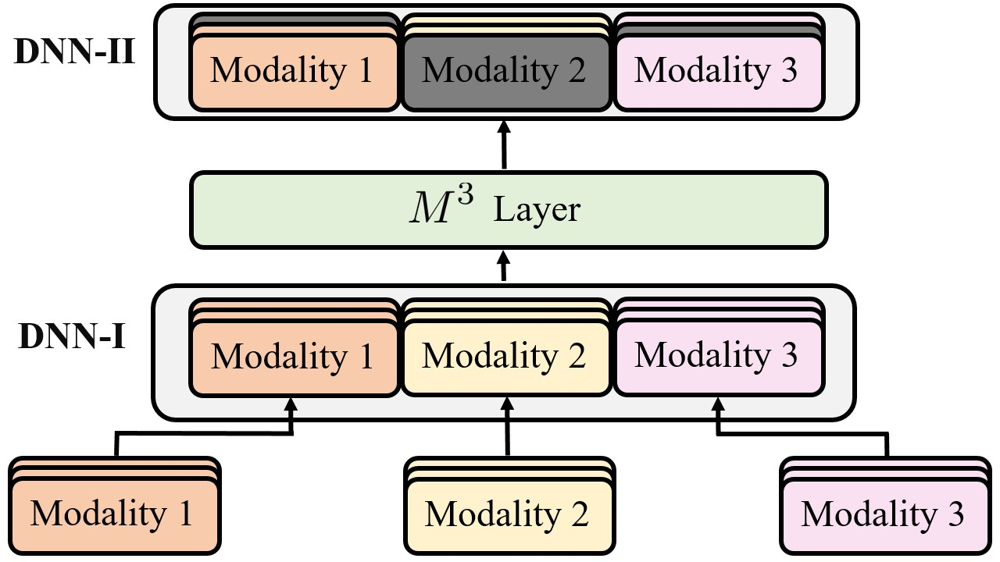

# Description
<!-- <p align="center">
    
    
    <a href="https://codeclimate.com/github/georgepar/slp/maintainability" alt="Maintainability">
        </a>
    <a href="https://choosealicense.com/licenses/mit/" alt="License: MIT">
        </a>
    <a href="https://img.shields.io/pypi/pyversions/slp">
        </a>
    <a href="https://black.readthedocs.io/en/stable/" alt="Code Style: Black">
        </a>
</p>

* **Repo:** [https://github.com/georgepar/slp](https://github.com/georgepar/slp)
* **Documentation:** [https://georgepar.github.io/slp/latest/](https://georgepar.github.io/slp/latest/)


slp is a framework for fast and reproducible development of multimodal models, with emphasis on
NLP models.

It started as a collection of scripts and code I wrote / collected during my PhD and it evolves
accordingly.

As such, the framework is opinionated and it follows a convention over configuration approach. -->

This repo contains the source code for the INTERSPEECH 2021 paper "$M^3$: MultiModal Masking applied to sentiment analysis" (Paper).

<p align="center">
  
</p>

<!-- This is currently in alpha release under active development, so things may break and new features will be added. -->

# Introduction
This paper presents a generic light-weight layer which can be emdedded in multimodal architectrues, namely $M^3$. This layer takes as input representations from various modalities, e.g. text, audio, visual. It then randomly either masks one of them or leaves the total representation unaffected. $M^3$ is applied at every time step in the multimodal sequence, acting as a form of regularization.


<!-- - [Pytorch Lightning](https://pytorch-lightning.readthedocs.io/en/stable/)
- [huggingface/transformers](https://huggingface.co/transformers/)
- [Wandb](https://wandb.ai/) -->

# Prerequisites
## Dependencies
 - Python >=3.7.3
 - [PyTorch](https://pytorch.org/) == 1.7.1
 - [slp](https://github.com/georgepar/slp) == 1.1.6

## Setup

- Clone repo with CMU Multimodal SDK submodule

```bash
# git version < 2.1.2
git clone --recursive https://github.com/efthymisgeo/multimodal-masking.git

# git version > 2.1.2
git clone --recurse-submodules https://github.com/efthymisgeo/multimodal-masking.git
```

- Create virtualenv and install dependencies

```bash
# Ensure your python version is >= 3.7.3

pip install poetry
poetry install
```

- Download data using CMU Multimodal SDK

```bash
mkdir -p data
python cmusdk.py data/
```


# M3 Experiments

- Optional
```bash
poetry shell
export PYTHONPATH=$PYTHONPATH:./CMU-MultimodalSDK
```
- Reproduce the result in `Table 1` of the paper

```python
python experiments/main.py --config configs/m3-rnn-hard-0.2-before.yaml --m3_sequential --m3_masking --use-mmdrop-before --gpus 1 --offline
```

- Reproduce the best results, illustrated in `Table 2`

```python
python experiments/main.py --config configs/m3-rnn-drop-text-0.6-hard-0.2-before.yaml --m3_sequential --m3_masking --use-mmdrop-before --gpus 1 --offline
```
- For further experimentation we suggest creating custom config `.yaml` files under `configs` folder and

```bash
python experiments/main.py --config configs/<myconf.yaml> --offline --gpus 1
```


# Reference

If you find our work useful for your research, please include the following citation

```
@proceedings{georgiou-2021-m3,
    title = "M3: MultiModal Masking applied to sentiment analysis",
    editor = "Georgiou, Efthymios  and
      Paraskevopoulos, Georgios  and
      Potamianos, Alexandros",
    booktitle = "INTERSPEECH 2021",
    year = "2021",
}
```


<!-- ## TODOs -->

<!-- * Optuna integration for hyperparameter tuning
* Add dataloaders for popular multimodal datasets
* Add multimodal architectures
* Add RIM, DNC and Kanerva machine implementations
* Write unit tests -->
